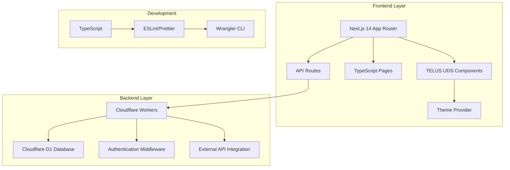

# 🚀 Next.js Cloudflare Workers Starter Kit - Implementation Plan

## 📋 Project Overview

A comprehensive Next.js starter kit optimized for Cloudflare Workers deployment, designed for **experimentation and prototyping**. Features TELUS UDS design system integration and hackathon-ready components for rapid development and testing of ideas.

> **⚠️ Important Note**: This starter kit is designed for **experimentation, prototyping, and hackathons only**. Cloudflare Workers deployment is not considered production-ready by TELUS standards and should be used for testing concepts and rapid development.

## 🎯 Core Implementation Scope (Phase 1 + 2)

### 🏗️ Architecture Overview



## 📦 Project Structure

```
kevin-cfw-nextjs-starter-ui/
├── 📁 src/
│   ├── 📁 app/                    # Next.js App Router
│   │   ├── 📁 api/                # API routes
│   │   │   ├── 📁 auth/           # Authentication endpoints
│   │   │   ├── 📁 users/          # User CRUD operations
│   │   │   └── 📁 external/       # External API example
│   │   ├── 📁 dashboard/          # Dashboard pages
│   │   ├── 📁 examples/           # Feature examples
│   │   ├── globals.css            # Global styles
│   │   ├── layout.tsx             # Root layout
│   │   └── page.tsx               # Home page
│   ├── 📁 components/             # Reusable components
│   │   ├── 📁 ui/                 # TELUS UDS components
│   │   ├── 📁 forms/              # Form components
│   │   ├── 📁 charts/             # Basic data visualization
│   │   └── 📁 layout/             # Layout components
│   ├── 📁 lib/                    # Utilities
│   │   ├── 📁 auth/               # Authentication logic
│   │   ├── 📁 database/           # D1 database utilities
│   │   ├── 📁 api/                # API client utilities
│   │   └── 📁 utils/              # General utilities
│   ├── 📁 styles/                 # TELUS theme configuration
│   └── 📁 types/                  # TypeScript definitions
├── 📁 public/                     # Static assets
├── 📁 docs/                       # Documentation
├── 📁 database/                   # D1 schema and migrations
├── 📄 wrangler.toml              # Cloudflare configuration
├── 📄 package.json               # Dependencies
├── 📄 next.config.js             # Next.js configuration
├── 📄 tailwind.config.js         # Tailwind + TELUS theme
├── 📄 tsconfig.json              # TypeScript configuration
└── 📄 README.md                  # Setup instructions
```

## 🎨 TELUS Design System Integration

### Core TELUS Brand Implementation
- **Primary Colors**: 
  - TELUS Purple (`#4B286D`)
  - TELUS Green (`#2A8A3E`) 
  - TELUS Light Green (`#00A04B`)
- **Typography**: TELUS font families and hierarchy
- **Components**: Button, Card, Form, Input, Layout, Navigation
- **Responsive Design**: Mobile-first with TELUS breakpoints

### Component Library Structure
```typescript
// TELUS theme configuration
const telusTheme = {
  colors: {
    primary: '#4B286D',      // TELUS Purple
    secondary: '#2A8A3E',    // TELUS Green
    accent: '#00A04B',       // TELUS Light Green
    background: '#FFFFFF',
    surface: '#F8F9FA',
    text: '#2C2C2E',
    textSecondary: '#6C757D'
  },
  spacing: {
    xs: '0.25rem',
    sm: '0.5rem', 
    md: '1rem',
    lg: '1.5rem',
    xl: '2rem',
    xxl: '3rem'
  }
}
```

## 🚀 Phase 1: Essential Foundation

### 1. Next.js 14 + TypeScript Setup
- **App Router**: Latest Next.js routing system
- **TypeScript**: Strict configuration with path aliases
- **Tailwind CSS**: Integrated with TELUS design tokens
- **ESLint/Prettier**: Code quality and formatting

### 2. Cloudflare Workers Configuration
- **Wrangler Setup**: CLI configuration for deployment
- **Environment Variables**: Development and staging configs
- **Edge Runtime**: Optimized for Cloudflare Workers
- **Custom Domain**: Ready for prototype deployment

### 3. TELUS UDS Integration
- **Theme Provider**: Global TELUS theme configuration
- **Core Components**: 
  - `TelusButton` - All button variants
  - `TelusCard` - Content containers
  - `TelusInput` - Form inputs with validation
  - `TelusLayout` - Page layouts and grids
  - `TelusNavigation` - Header and sidebar navigation

### 4. Authentication Structure
- **Auth Middleware**: Ready for OAuth wrapper integration
- **Protected Routes**: Route protection utilities
- **User Context**: React context for user state
- **Login/Logout**: Basic authentication flow structure

### 5. Cloudflare D1 Database
- **Schema Definition**: Users, projects, settings tables
- **Migration Scripts**: Database setup and versioning
- **CRUD Utilities**: Type-safe database operations
- **Seed Data**: Sample data for development

### 6. Basic API Routes
```typescript
// API structure
/api/auth/login          // Authentication
/api/auth/logout         // Logout
/api/users              // User CRUD operations
/api/users/[id]         // Individual user operations
/api/health             // Health check endpoint
```

### 7. Dashboard Layout
- **Responsive Layout**: Mobile-first dashboard design
- **Navigation**: Sidebar and header navigation
- **Content Areas**: Main content and sidebar layouts
- **TELUS Styling**: Consistent with TELUS design system

## 🎯 Phase 2: Hackathon Essentials

### 1. Complete Form Handling
- **Form Validation**: Client and server-side validation
- **Error Handling**: User-friendly error messages
- **Loading States**: Proper loading indicators
- **Form Components**:
  - Contact forms
  - User registration/profile forms
  - Settings forms
  - Multi-step form example

### 2. File Upload Functionality
- **Cloudflare R2 Integration**: File storage setup
- **Upload Components**: Drag-and-drop file upload
- **Image Processing**: Basic image optimization
- **File Management**: Upload, delete, and list files

### 3. External API Integration Example
- **Weather API**: Simple external API example
- **API Client**: Reusable API client utilities
- **Error Handling**: Robust error management
- **Caching**: Basic response caching
- **Rate Limiting**: Request throttling

### 4. Data Visualization
- **Chart Components**: Using Chart.js or Recharts
- **Dashboard Widgets**: 
  - Statistics cards
  - Progress indicators
  - Simple bar/line charts
  - Data tables with sorting
- **Real-time Updates**: Basic data refresh functionality

### 5. Responsive Design Polish
- **Mobile Optimization**: Touch-friendly interfaces
- **Tablet Support**: Medium screen layouts
- **Desktop Enhancement**: Full desktop experience
- **Accessibility**: WCAG compliance basics

### 6. Error Handling & Loading States
- **Global Error Boundary**: Application-wide error handling
- **Loading Components**: Skeleton screens and spinners
- **Toast Notifications**: Success/error messages
- **404/500 Pages**: Custom error pages

## 🛠️ Development Tools & Configuration

### TypeScript Configuration
```json
{
  "compilerOptions": {
    "strict": true,
    "baseUrl": ".",
    "paths": {
      "@/*": ["./src/*"],
      "@/components/*": ["./src/components/*"],
      "@/lib/*": ["./src/lib/*"],
      "@/types/*": ["./src/types/*"]
    }
  }
}
```

### Package Dependencies
```json
{
  "dependencies": {
    "next": "^14.0.0",
    "@telus-uds/components-base": "latest",
    "tailwindcss": "^3.0.0",
    "typescript": "^5.0.0",
    "react": "^18.0.0",
    "react-dom": "^18.0.0"
  },
  "devDependencies": {
    "wrangler": "^3.0.0",
    "eslint": "^8.0.0",
    "prettier": "^3.0.0",
    "@types/react": "^18.0.0",
    "@types/node": "^20.0.0"
  }
}
```

## 📚 Documentation Structure

### 1. Quick Start Guide (README.md)
```markdown
# 🚀 5-Minute Setup for Prototyping
⚠️ **For experimentation and prototyping only**

1. Clone repository
2. Install dependencies: `npm install`
3. Setup environment: `npm run setup`
4. Start development: `npm run dev`
5. Deploy prototype: `npm run deploy`
```

### 2. Feature Documentation
- **Component Usage**: How to use each TELUS component
- **API Examples**: Copy-paste API implementations
- **Database Patterns**: Common D1 query examples
- **Authentication**: OAuth wrapper integration guide

### 3. Deployment Guide
- **Cloudflare Setup**: Account configuration for prototyping
- **Environment Variables**: Development and staging settings
- **Custom Domains**: DNS setup for prototype testing
- **Limitations**: Cloudflare Workers constraints and considerations

## 🔧 Setup & Development Scripts

### Installation & Setup
```bash
npm run setup              # Complete project setup
npm run setup:env          # Environment configuration
npm run setup:db           # Database initialization
npm run setup:auth         # Authentication setup
```

### Development
```bash
npm run dev                # Development server
npm run build              # Build for deployment
npm run deploy             # Deploy prototype to Cloudflare
npm run db:migrate         # Run database migrations
npm run db:seed            # Seed sample data
npm run lint               # Code linting
npm run type-check         # TypeScript validation
```

## 🎯 Key Features for Hackathon Teams

### Immediate Value
- **5-minute setup**: Get prototyping immediately
- **TELUS-branded**: Professional appearance for demos
- **Database ready**: CRUD operations pre-built
- **Authentication structure**: Ready for OAuth integration
- **Responsive design**: Works on all devices

### Copy-Paste Examples
- **User management**: Complete user CRUD
- **Form handling**: Validated forms with error handling
- **API integration**: External API call examples
- **File uploads**: Image and document upload
- **Data visualization**: Charts and dashboards

### Extensibility
- **Modular components**: Easy to extend and customize
- **Type-safe**: Full TypeScript support
- **Well-documented**: Clear examples and guides
- **Prototype-ready**: Scalable architecture for testing ideas

## 🚀 Deployment Strategy

### Cloudflare Workers for Prototyping
- **Edge deployment**: Global performance for demos
- **Auto-scaling**: Handle demo traffic spikes
- **Fast deployment**: Quick iterations during development
- **Cost-effective**: Minimal costs for prototyping

### Environment Management
```bash
# Development
wrangler dev

# Staging/Demo deployment
wrangler deploy --env staging

# Prototype deployment  
wrangler deploy --env prototype
```

### ⚠️ Important Considerations
- **Not for production**: Use only for experimentation and prototyping
- **Data persistence**: Understand D1 limitations for prototype data
- **Security**: Basic security suitable for demos and testing
- **Scalability**: Designed for prototype-level traffic
- **Migration path**: Plan for moving to TELUS-approved infrastructure

## ✅ Success Criteria

### Phase 1 + 2 Completion Checklist
- [ ] Next.js 14 + TypeScript fully configured
- [ ] TELUS UDS components integrated and themed
- [ ] Cloudflare Workers deployment working for prototypes
- [ ] D1 database with CRUD operations
- [ ] Authentication structure ready for OAuth
- [ ] Complete form handling with validation
- [ ] File upload functionality working
- [ ] External API integration example
- [ ] Basic data visualization components
- [ ] Responsive design across all devices
- [ ] Error handling and loading states
- [ ] Comprehensive documentation with limitations clearly stated
- [ ] 5-minute setup process validated

### Ready for OAuth Integration
- Authentication middleware structure in place
- User context and state management ready
- Protected routes configured
- Session management prepared
- Integration points clearly documented

## 🎉 Outcome

After Phase 1 + 2 implementation, hackathon teams will have:

1. **Immediate productivity**: Start building prototypes on day one
2. **Professional UI**: TELUS-branded, responsive interface for demos
3. **Backend ready**: Database and API infrastructure for testing
4. **Authentication prepared**: Ready for OAuth wrapper integration
5. **Rich examples**: Copy-paste code for common patterns
6. **Quick deployment**: One-command deployment for prototype sharing
7. **Extensible foundation**: Easy to add new features for experimentation

This creates a comprehensive, hackathon-ready starter kit optimized for **rapid prototyping and experimentation**, with clear understanding that it's designed for testing ideas rather than production deployment.