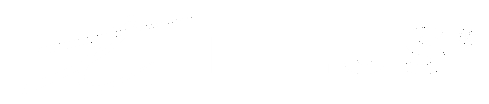

# Next.js Cloudflare Workers Starter Kit

A comprehensive Next.js starter kit optimized for Cloudflare Workers deployment, designed for **experimentation and prototyping**. Features TELUS-styled components and hackathon-ready examples.

> ⚠️ **Important Note**: This starter kit is designed for **experimentation, prototyping, and hackathons only**. Cloudflare Workers deployment is not considered production-ready by TELUS standards and should be used for testing concepts and rapid development.



## 🚀 Features

- **Next.js 14 App Router**: Latest Next.js features with App Router and React Server Components
- **TypeScript**: Type-safe development with TypeScript
- **Cloudflare Workers**: Optimized for deployment to Cloudflare's edge network
- **Cloudflare D1 Database**: Serverless SQL database integration
- **TELUS Styling**: Custom components styled according to TELUS design system
- **Form Handling**: Complete form examples with validation using React Hook Form and Zod
- **API Routes**: Ready-to-use API examples with Cloudflare D1 integration
- **Dashboard Layout**: Responsive dashboard with data visualization examples
- **File Upload**: File upload examples with Cloudflare R2 storage
- **Authentication Structure**: Ready for OAuth integration

## 📋 Quick Start

### Prerequisites

- [Node.js](https://nodejs.org/) (v18 or later)
- [npm](https://www.npmjs.com/) (v8 or later)
- [Wrangler CLI](https://developers.cloudflare.com/workers/wrangler/install-and-update/) (for Cloudflare Workers deployment)
- [Cloudflare Account](https://dash.cloudflare.com/sign-up) (free tier is sufficient for prototyping)

### Installation

1. Clone the repository:

```bash
git clone https://github.com/your-org/kevin-cfw-nextjs-starter-ui.git
cd kevin-cfw-nextjs-starter-ui
```

2. Install dependencies:

```bash
npm install
```

3. Start the development server:

```bash
npm run dev
```

4. Open [http://localhost:3000](http://localhost:3000) in your browser to see the application.

## 🛠️ Development

### Project Structure

```
kevin-cfw-nextjs-starter-ui/
├── src/
│   ├── app/                    # Next.js App Router
│   │   ├── api/                # API routes
│   │   ├── dashboard/          # Dashboard pages
│   │   └── examples/           # Example pages
│   ├── components/             # Reusable components
│   ├── lib/                    # Utilities
│   │   ├── database/           # D1 database utilities
│   │   └── ...                 # Other utilities
│   ├── styles/                 # TELUS theme configuration
│   └── types/                  # TypeScript definitions
├── database/                   # D1 schema and migrations
├── public/                     # Static assets
├── wrangler.toml               # Cloudflare configuration
└── ...                         # Other configuration files
```

### Available Scripts

```bash
# Development
npm run dev                 # Start development server

# Building
npm run build               # Build for production
npm run lint                # Run ESLint
npm run type-check          # Run TypeScript type checking

# Deployment
npm run deploy              # Deploy to Cloudflare Workers
npm run deploy:staging      # Deploy to staging environment
```

## 🗄️ Database Setup

This starter kit uses Cloudflare D1 for database storage. Follow these steps to set up your D1 database:

1. Create a D1 database:

```bash
wrangler d1 create starter-kit-db
```

2. Update the `wrangler.toml` file with your database ID:

```toml
[[d1_databases]]
binding = "DB"
database_name = "starter-kit-db"
database_id = "your-database-id-here" # Replace with your database ID
```

3. Apply the schema to your database:

```bash
wrangler d1 execute starter-kit-db --file=./database/schema.sql
```

## 📤 File Storage Setup

For file upload functionality, this starter kit uses Cloudflare R2 storage:

1. Create an R2 bucket:

```bash
wrangler r2 bucket create starter-kit-files
```

2. Update the `wrangler.toml` file with your bucket configuration:

```toml
[[r2_buckets]]
binding = "FILES"
bucket_name = "starter-kit-files"
```

## 🚀 Deployment

### Deploying to Cloudflare Workers

1. Authenticate with Cloudflare:

```bash
wrangler login
```

2. Build the application:

```bash
npm run build
```

3. Deploy to Cloudflare Workers:

```bash
npm run deploy
```

### Environment Configuration

Create a `.env` file for local development:

```
# .env
ENVIRONMENT=development
```

For different environments, you can use Cloudflare's environment variables in the `wrangler.toml` file.

## 🧩 Examples

This starter kit includes several examples to help you get started:

- **Form Handling**: `/examples/forms`
- **API Integration**: `/examples/api`
- **Dashboard**: `/dashboard`
- **File Upload**: `/examples/upload`
- **Authentication**: `/examples/auth`
- **UI Components**: `/examples/components`

Each example includes detailed documentation and code snippets.

## 🔒 Authentication

The starter kit includes a basic authentication structure that's ready for OAuth integration. The authentication flow is designed to work with the TELUS OAuth wrapper that will be provided separately.

## 🎨 TELUS Styling

The starter kit includes custom components styled according to the TELUS design system. These components are built with Tailwind CSS and follow TELUS brand guidelines for colors, typography, and spacing.

## ⚠️ Limitations

- This starter kit is designed for **experimentation and prototyping only**
- Cloudflare Workers have [certain limitations](https://developers.cloudflare.com/workers/platform/limits/) to be aware of
- D1 database is still in beta and may have performance limitations for high-traffic applications
- The styling is inspired by TELUS design system but does not use the official TELUS UDS components

## 📚 Resources

- [Next.js Documentation](https://nextjs.org/docs)
- [Cloudflare Workers Documentation](https://developers.cloudflare.com/workers/)
- [Cloudflare D1 Documentation](https://developers.cloudflare.com/d1/)
- [Cloudflare R2 Documentation](https://developers.cloudflare.com/r2/)

## 📝 License

This project is licensed under the [MIT License](LICENSE).
